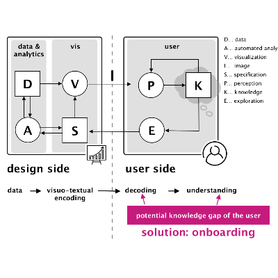

[VisComm Home](/)

# VisComm 2019 Schedule

**VisComm Session 1: Visualization for Specific Audiences (9:00am - 10:30am)**

<table>
  <tbody>
    <tr>
      <td></td>
      <td>
        <strong>Visualization Onboarding: Learning how to Read and Use Visualizations</strong>   
        Christina Stoiber, Florian-Gregor Grassinger, Margit Pohl, Holger Stitz, Marc Streit, and Wolfgang Aigner   
        <a href="http://google.com">Paper</a>
      </td>
    </tr>
    <tr>
      <td>&nbsp;</td>
      <td>&nbsp;</td>
    </tr>
    <tr>
      <td>&nbsp;</td>
      <td>&nbsp;</td>
    </tr>
    <tr>
      <td>&nbsp;</td>
      <td>&nbsp;</td>
    </tr>
    <tr>
      <td>&nbsp;</td>
      <td>&nbsp;</td>
    </tr>
  </tbody>
</table>

- *Visualization Onboarding: Learning how to Read and Use Visualizations* by Christina Stoiber, Florian-Gregor Grassinger, Margit Pohl, Holger Stitz, Marc Streit, and Wolfgang Aigner (Paper)
- *Designing Communicative Visualization for People with Intellectual Developmental Disabilities* by Keke Wu, Shea Tanis, and Danielle Albers Szafir (Paper)
- *LEGO as Language for Visual Communication* by Stuart Flack, Kevin Ponto, Travis Tangen, and Karen Schloss (Visual Case Study)
- *Vernacular Visualization Practices* by Jaime Snyder (Poster)
- *Colors and Imagery in Tailored Infographics for Communicating Health Information to Patients and Research Participants* by Adriana Arcia (Poster)

**Break (10:30am - 10:50am)**

**VisComm Session 2: Visualization for Communication & Journalism  (10:50am - 12:20pm)**

- *Visual Communication and Heuristics: Challenges and Directions from Across the Disciplines* by David Berube (Paper)
- *Categorizing and Ranking Graphs in the American Economic Review Over the Last Century* by Jon Schwabish (Paper)
- *Data Visualization + Scrollytelling for Election News Stories : Challenges and Perspectives* by Jean-Philippe Corbeil, Florent Daudens and Thomas Hurtut (Visual Case Study)
- *Launching the Parametric Press* by Matthew Conlen and Fred Hohman (Visual Case Study)
- *Guiding the Reader to Statistical Focus and Context of Industrial News Reports* by Ken Wakita and Kohei Arimoto (Poster)
- *A Visualization Course for Journalism Students* by Stefan Jänicke (Poster)
